## Protocol Release Log

Prot. Version | Date       | Comment
:-------------|:-----------|:-------
0.1           | 28‑02‑2012 | Concept, Functional specification
0.2           | 21‑05‑2012 | VAS data added
1.0           | 12‑12‑2013 | Use-case driven structure; Delta-Synchronization; Live-Authorization; CDR-Validation; Alignment to standardization and market development.
1.2           | 17‑06‑2014 | Live Status Interface and further enhancements from market requirements. Commit: [6a1dcb07cfa75f8b3deb185c55ce451bb8703cb5](../../commit/6a1dcb07cfa75f8b3deb185c55ce451bb8703cb5)


Copyright (c) 2012-2015 smartlab, bluecorner.be, e-laad.nl

Permission is hereby granted, free of charge, to any person obtaining a 
copy of this software and associated documentation files 
(the "Software"), to deal in the Software without restriction, 
including without limitation the rights to use, copy, modify, merge, 
publish, distribute, sublicense, and/or sell copies of the Software, 
and to permit persons to whom the Software is furnished to do so, 
subject to the following conditions:

The above copyright notice and this permission notice shall be included 
in all copies or substantial portions of the Software.

THE SOFTWARE IS PROVIDED "AS IS", WITHOUT WARRANTY OF ANY KIND, EXPRESS 
OR IMPLIED, INCLUDING BUT NOT LIMITED TO THE WARRANTIES OF 
MERCHANTABILITY, FITNESS FOR A PARTICULAR PURPOSE AND NONINFRINGEMENT. 
IN NO EVENT SHALL THE AUTHORS OR COPYRIGHT HOLDERS BE LIABLE FOR ANY 
CLAIM, DAMAGES OR OTHER LIABILITY, WHETHER IN AN ACTION OF CONTRACT, 
TORT OR OTHERWISE, ARISING FROM, OUT OF OR IN CONNECTION WITH THE 
SOFTWARE OR THE USE OR OTHER DEALINGS IN THE SOFTWARE.


 * * *

# Contents

- [Preface](#preface)
    - [Document Versioning](#document-versioning)
    - [Conventions](#conventions)
- [Abbreviations](#abbreviations)
- [Introduction](#introduction)
    - [Primary Stakeholders Electric Vehicles](#primary-stakeholders-electric-vehicles)
        - [Electric Vehicle User (EV User)](#electric-vehicle-user-ev-user)
        - [Electric Vehicle Service Provider (EVSP)](#electric-vehicle-service-provider-evsp)
        - [Electric Vehicle Supply Equipment Operator (EVSE Operator)](#electric-vehicle-supply-equipment-operator-evse-operator)
        - [Navigation Service Provider (NSP)](#navigation-service-provider-nsp)
        - [Charging Session](#charging-session)
    - [Clearing House](#clearing-house)
    - [Clearing House functionality](#clearing-house-functionality)
    - [Functional principles of an EV Clearing House](#functional-principles-of-an-ev-clearing-house)
    - [OCHP direct Extension](#ochp-direct-extension)
        - [Definition of OCHP direct](#definition-of-ochp-direct)
- [CH-Partner Interface description](#ch-partner-interface-description)
    - [Exchange Authorisation Data](#exchange-authorisation-data)
        - [Upload own authorisation data (roaming list) to the CHS](#upload-own-authorisation-data-roaming-list-to-the-chs)
        - [Update own authorisation data (roaming list) in the CHS](#update-own-authorisation-data-roaming-list-in-the-chs)
        - [Download global roaming authorisation data from CHS](#download-global-roaming-authorisation-data-from-chs)
        - [Download updates in global roaming authorisation data from CHS](#download-updates-in-global-roaming-authorisation-data-from-chs)
    - [Exchange Charge Data](#exchange-charge-data)
        - [Upload Charge Data Records](#upload-charge-data-records)
        - [Process Charge Data Records](#process-charge-data-records)
    - [Exchange Charge Point Information](#exchange-charge-point-information)
        - [Upload own charge point information to the CHS](#upload-own-charge-point-information-to-the-chs)
        - [Download global charge point information from the CHS](#download-global-charge-point-information-from-the-chs)
    - [Live Request for a single authorization](#live--request-for-a-single-authorization)
        - [Request the CHS to authorize one single token for roaming](#-request-the-chs-to-authorize-one-single-token-for-roaming)
    - [Live Status Interface](#live-status-interface)
        - [Update the live status of the own stations in the CHS](#update-the-live-status-of-the-own-stations-in-the-chs)
        - [Download global live status information from the CHS](#download-global-live-status-information-from-the-chs)
- [Messages](#messages)
    - [Messages for the Exchange of Authorisation Data](#messages-for-the-exchange-of-authorisation-data)
        - [GetRoamingAuthorisationList.req](#getroamingauthorisationlist-req)
        - [GetRoamingAuthorisationList.conf](#getroamingauthorisationlist-conf)
        - [SetRoamingAuthorisationList.req](#setroamingauthorisationlist-req)
        - [SetRoamingAuthorisationList.conf](#setroamingauthorisationlist-conf)
        - [GetRoamingAuthorisationListUpdates.req](#getroamingauthorisationlistupdates-req)
        - [GetRoamingAuthorisationListUpdates.conf](#getroamingauthorisationlistupdates-conf)
        - [UpdateRoamingAuthorisationList.req](#updateroamingauthorisationlist-req)
        - [UpdateRoamingAuthorisationList.conf](#updateroamingauthorisationlist-conf)
    - [Messages for the Exchange of Charge Data](#messages-for-the-exchange-of-charge-data)
        - [GetCDRs.req](#getcdrs-req)
        - [GetCDRs.conf](#getcdrs-conf)
        - [AddCDRs.req](#addcdrs-req)
        - [AddCDRs.conf](#addcdrs-conf)
        - [ConfirmCDRs.req](#-confirmcdrs-req)
        - [ConfirmCDRs.conf](#-confirmcdrs-conf)
    - [Messages for the Exchange of Charge Point Information](#messages-for-the-exchange-of-charge-point-information)
        - [GetChargePointList.req](#getchargepointlist-req)
        - [GetChargePointList.conf](#getchargepointlist-conf)
        - [SetChargePointList.req](#setchargepointlist-req)
        - [SetChargePointList.conf](#setchargepointlist-conf)
        - [GetChargePointListUpdates.req](#getchargepointlistupdates-req)
        - [GetChargePointListUpdates.conf](#getchargepointlistupdates-conf)
        - [UpdateChargePointList.req](#updatechargepointlist-req)
        - [UpdateChargePointList.conf](#updatechargepointlist-conf)
    - [Messages for live authorisation](#messages-for-live-authorisation)
        - [RequestLiveRoamingAuthorisation.req](#-requestliveroamingauthorisation-req)
        - [RequestLiveRoamingAuthorisation.conf](#-requestliveroamingauthorisation-conf)
    - [Messages for the Live Status Interface](#messages-for-the-live-status-interface)
        - [UpdateStatus.req](#updatestatus-req)
        - [UpdateStatus.conf](#updatestatus-conf)
        - [GetStatus.req](#getstatus-req)
        - [GetStatus.conf](#getstatus-conf)
- [Types](#types)
    - [General Types](#general-types)
        - [Result *class*](#result-class)
        - [ResultCodeType *enum*](#resultcodetype-enum)
        - [DateTimeType](#datetimetype)
        - [LocalDateTimeType](#localdatetimetype)
    - [Types for the Exchange of Authorisation Data](#types-for-the-exchange-of-authorisation-data)
        - [ContractId (or EVCO-ID)](#contractid-or-evco-id)
        - [EmtId *class*](#emtid-class)
        - [tokenType *enum*](#tokentype-enum)
        - [tokenSubType *enum*](#tokensubtype-enum)
        - [tokenRepresentation *enum*](#tokenrepresentation-enum)
        - [RoamingAuthorisationInfo *class*](#roamingauthorisationinfo-class)
    - [Types for the Exchange of Charge Data](#types-for-the-exchange-of-charge-data)
        - [BillingItemType *enum*](#billingitemtype-enum)
        - [CdrPeriodType *class*](#cdrperiodtype-class)
        - [CdrStatusType *enum*](#cdrstatustype-enum)
        - [CDRInfo *class*](#cdrinfo-class)
    - [Types for the Exchange of Charge Point Information](#types-for-the-exchange-of-charge-point-information)
        - [EvseId](#evseid)
        - [evseImageUrlType *class*](#evseimageurltype-class)
        - [ImageClass *enum*](#imageclass-enum)
        - [GeoPointType *class*](#geopointtype-class)
        - [ConnectorStandard *enum*](#connectorstandard-enum)
        - [ConnectorFormat *enum*](#connectorformat-enum)
        - [ConnectorType *class*](#connectortype-class)
        - [AuthMethodType *enum*](#authmethodtype-enum)
        - [ChargePointStatusType *enum*](#chargepointstatustype-enum)
        - [ChargePointScheduleType *class*](#chargepointscheduletype-class)
        - [HoursType *class*](#hourstype-class)
        - [RegularHoursType *class*](#regularhourstype-class)
        - [ExceptionalPeriodType *class*](#exceptionalperiodtype-class)
        - [ParkingRestrictionType *enum*](#parkingrestrictiontype-enum)
        - [ChargePointInfo *class*](#chargepointinfo-class)
    - [Types for live authorisation](#types-for-live-authorisation)
        - [LiveAuthId *class*](#liveauthid-class)
    - [Types for the Live Status Interface](#types-for-the-live-status-interface)
        - [MajorType *enum*](#majortype-enum)
        - [MinorType *enum*](#minortype-enum)
        - [EvseStatusType *class*](#evsestatustype-class)
- [Binding to Transport Protocol](#binding-to-transport-protocol)
    - [User Identification](#user-identification)
- [Annexes](#annexes)
    - [ID Validation and Transformation Tools](#id-validation-and-transformation-tools)
        - [Regular expression for EVSE-ID validation](#regular-expression-for-evse-id-validation)
        - [Regular expression for Contract-ID validation](#regular-expression-for-contract-id-validation)
        - [Regular expression for Contract-ID normalization](#regular-expression-for-contract-id-normalization)
    - [List of examples for valid Contract-Ids](#list-of-examples-for-valid-contract-ids)
    - [Data Field Mapping to OCPP](#data-field-mapping-to-ocpp)
        - [Connector Types](#connector-types)
    - [EVSE Infrastructure Model](#evse-infrastructure-model)
        - [Data Model Structure](#data-model-structure)
        - [Examples](#examples)
    - [Charge Point Information Filtering](#charge-point-information-filtering)


 * * *
 


# Preface

This document defines a standard interface between different parties in
the market of electric vehicle charging infrastructure and a clearing
house that provides a common data routing and exchange platform for all
these market shareholders.


## Document Versioning

The versions of this document refer to the non-functional or proposed 
enhancements and are not to be confused with the derived protocol 
states labelled by the protocol version numeration. To illustrate this, 
the following figure shows the development process of this protocol.

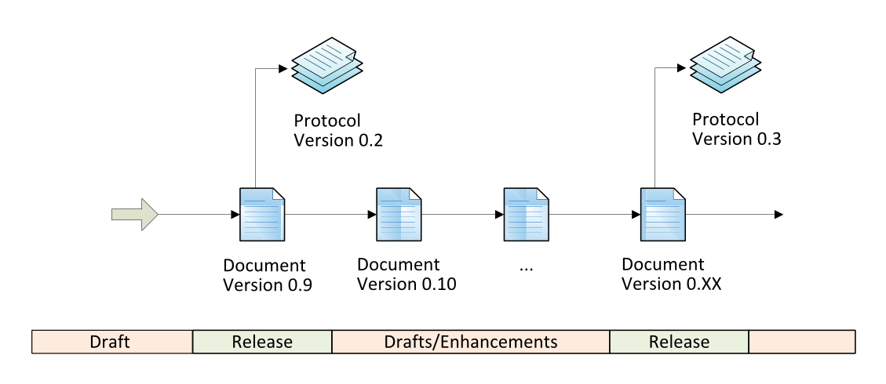


## Conventions

The key words *must*, *must not*, *required*, *shall*, *shall
not*, *should*, *should not*, *recommended*, *may* and
*optional* in this document are to be interpreted as described in
[https://tools.ietf.org/html/rfc2119](RFC 2119).

The cardinality is defined by the indicators _*_, *+*, *?* and
*1*, where the last one is the default. The meaning and mapping to
XML syntax is as follows:

Meaning      | XML Schema                                    | DTD
:------------|:----------------------------------------------|---
At most one  | `minOccurs="0" maxOccurs="1"`                 | ?
one or more  | `minOccurs="1" maxOccurs="unbounded"`         | +
zero or more | `minOccurs="0" maxOccurs="unbounded"`         | *
exactly one  | *(default)*                                   | 1

For some data fields a [http://en.wikipedia.org/wiki/Regular_expression](Regular Expression) is
provided as an additional but very precise definition of the data
format.

The character *>* in front of any data field indicates a choice of 
multiple possibilities.

The character *~* appended to any data field indicates the 
implementation as XML attribute instead of an element.


# Abbreviations

Abbreviation | Meaning
:------------|:--------
CDR          | Charge Detail Record
CH           | Clearing House
CHS          | Clearing House System
CMS          | Charge Point Management System
Contract-ID  | Contract (or Account) Identifier
EMP          | Electric Mobility Provider
EMT-ID       | Electric Mobility Token Identifier
EV           | Electrical Vehicle
EVCO-ID      | Electrical Vehicle Contract Identifier
EVSE         | Electrical Vehicle Supply Equipment
EVSE-ID      | Electrical Vehicle Supply Equipment Identifier
EVSE-Op      | EVSE Operator
EVSP         | Electric Vehicle Service Provider
ID           | Identifier
MDM          | Master Data Management System
NSP          | Navigation Service Provider
OCHP         | Open Clearing House Protocol
PDU          | Protocol Data Unit
RA           | Roaming Authorisation
RFID         | Radio-frequency identification
VAS          | Value Added Service


# Introduction


## Primary Stakeholders Electric Vehicles

The purpose of the Open Clearing House Protocol is to connect market
actors in the field of electric mobility charging infrastructure. The
different relevant market roles are as shown in the market overview 
figure:
 * The *EV user* of the overall system - a human charging an electric 
   car via the connected infrastructure, having a direct or indirect 
   service contract with an EVSP.
 * The *EVSP* (Electric Vehicle Service Provider) - granting access to 
   charging stations and thus offering services to the contracted EV 
   user. The service offer is supported by the market roles EVSE 
   Operator and NSP.
 * The *EVSE Operator* (Electric Vehicle Supply Equipment Operator) - 
   operating charging stations.
 * The *NSP* (Navigation Service Provider) - offering relevant 
   navigation services to the EV user.
 * The *Clearing House Operator* - running a software platform called 
   Clearing House to enable data exchange between the market roles (2) 
   to (4).

In the context of a clearing house system the market roles (2) to (4)
are referred as *partners*, the role (5) is called
*administrator*. The role (1) is not explicitly known to the system.
The role of a clearing house in terms of this document is to facilitate
the exchange of roaming authorisations, charge point information and
charge detail records between the market participants. Other clearing
houses and local networks might serve the same purpose on a different
scale/region or with different partners. The connection to other
clearing houses is out of scope in the current state. The market roles
are defined in the following section. One company however might fulfil
one or more market roles. The contracts between each actor and the data
routing are part of the clearing house's business logic and out of scope
for this protocol description.

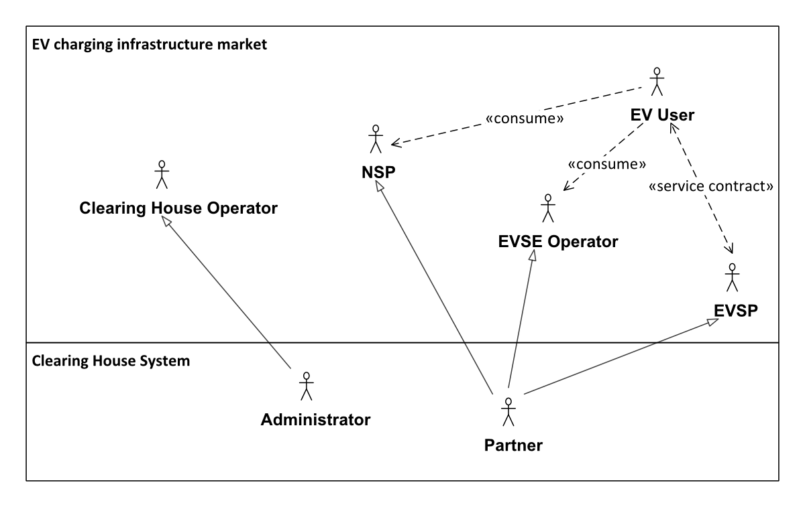


### Electric Vehicle User (EV User)

The EV user has a direct or indirect service contract with an EVSP who
grants access to a specified charging infrastructure of one or more EVSE
Operators. The EV users identify their selves via an access token issued
by the EVSP.


### Electric Vehicle Service Provider (EVSP)

The EVSP operates as a contract party for the EV user. The EV Service
Provider takes care of the EV user authentication and billing processes.
The EV Service Provider provides the EV-customer authorization tokens
(i.e. RFID-card, Certificates, ... ) that give authorisation to use
the charging stations of contracted EVSE Operators.


### Electric Vehicle Supply Equipment Operator (EVSE Operator)

The EVSE operator operates as contract party for the EVSP. The charging
stations (EVSE) of the EVSE operator are accessible by a specified set
of EV users of the contracted EVSPs. The EVSP pays the EVSE operator for
the charging services received by its contracted EV users.


### Navigation Service Provider (NSP)

The NSP offers service towards the EV user for searching, locating and
routing to EVSEs of the contracted EVSE operators. It therefore may have
contracts with EVSE operators or EVSPs.


### Charging Session

A charging session in the scope of this document is defined from the
successful authorization of the user at the charge point. It is
considered active until the successful authorized stop command was
executed (first figure below) or the car was disconnected from the 
charge point manually (second figure below). This is considered a 
forced unauthorized ending.

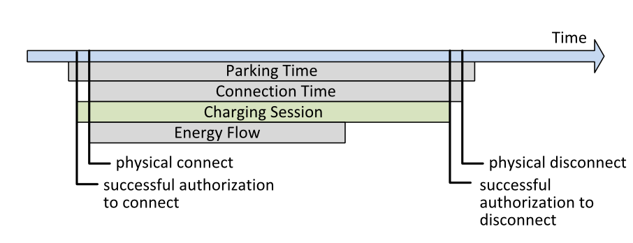

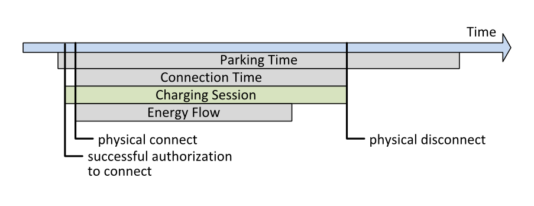


## Clearing House

The basic idea of a Clearing House is to enable the connected partners
to roam with each other. The goal of roaming is that EV users can
easily charge their electric vehicle on every charging station of
different EVSE operators. With roaming support, provided by the Clearing
House, the complexity of relationships can be reduced: from many-to-many
bilateral partner connection towards a one-to-many connection between
the Clearing House and the partners. The figure illustrates the overall 
system overview of all partners with their systems and the clearing 
house system with the EV user as service consumer.

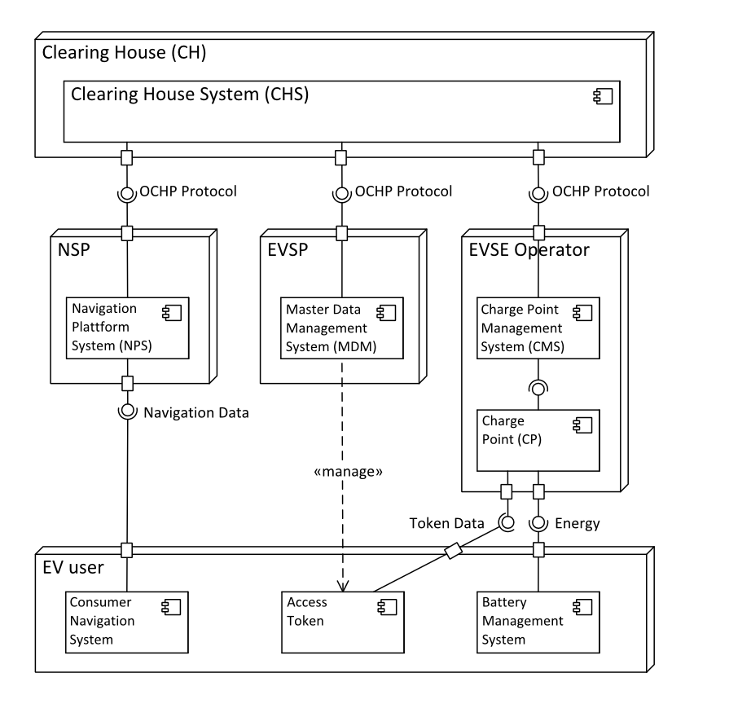

A different view to the implementation of the described role model gives
figure below. The clearing house provides here a central
connection between the operator layer — where the charging stations are
located — and the provider layer — where the users are. Direct
connections of two roaming partners on the same layer are not necessary.
Each partner operates a single connection to the clearing house from
through which they get connected to multiple partners on the other
layers.
Some of the partners might take two or more roles on different layers.
For each of their roles a connection to the clearing house is necessary
to connect to other roaming partners. The internal data connection
between the distinct roles of one single partner might or might not be
routed through the clearing house.
For the sake of simplification only two layers are shown in this figure.
The same principles apply to the navigation service layer. Also other 
additional clearing houses could exist in this model.

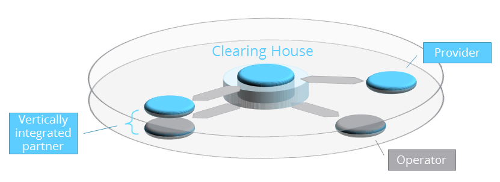


## Clearing House functionality

An EV clearing house in the scope of this protocol facilitates the
mutual exchange of roaming authorisations, charge data & charge point
information between its partners. The formal act of clearing - as meant
here - is the assignment of charge detail records to the corresponding
EV Service Provider. The financial clearing has to be executed in a
subsequent process step and is out of scope of the interface addressed
by OCHP. However, the here defined data types are meant to be used as a
base to calculate the payment request.
Normally the following steps are followed, (*highlighted* steps are
in scope of OCHP):

 * *An EVSP (Partner A) uploads authorisation data of its EV users to 
   the Clearing House (CH).*
 * *The EVSE operators that have a roaming contract with (A), download 
   this authorisation data from the CH.*
 * The EVSE operators enable these authorisations to be used on their 
   charge points.
 * The EV users of partner (A) can now charge their electric vehicles 
   at all charge points of the EVSE operators named in step 2.
 * *The EVSE operator uploads the charge data (using Charge Detail 
   Records) to the CH.*
 * *This charge data is then routed by the CH towards partner (A) using 
   OCHP.*
 * Partner (A) pays the roaming partner for the charging action done by 
   its customer.
 * Partner (A) bills its customer.


## Functional principles of an EV Clearing House

As an intermediate between two independent roaming partners, a clearing 
house serves to simplify and unify the data connection. There are few 
main principles, the business logic of a clearing house for electric 
mobility should follow. Those basic rules are:

 * *Transparency* The existence of a clearing house should be 
   completely transparent for the EV user. The roaming connection 
   between an operator and a provider may or may not be routed through 
   a clearing house.
 * *Independence* Roaming connections between two roaming partners and 
   their business models or tariffs should not be influenced by the 
   logic of the clearing house.
 * *Anonymity*    The clearing house should require as little private 
   user data as possible.

OCHP supports those basic principles and aims to be capable to any 
business model following them.


## OCHP direct Extension

Starting with Protocol Version 1.3, OCHP offers the possibility to 
open a _direct_ communication between two roaming partners. The 
following figure illustrates the additional data path.

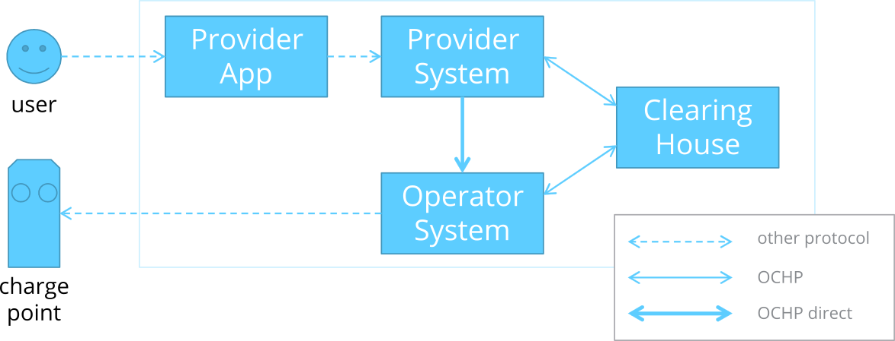

The direct communication between operators and providers allows the 
implementation of fundamental new use cases between two roaming 
partners. Those use cases are:

#### Basic use cases
 * **Remote Start:** A user starts a charging process at an operator‘s 
   charge pole by using a provider‘s app. They are starting the process 
   from a – of the operator's point of view – remote service.
 * **Remote Stop:** A user stops a charging process at an operator‘s 
   charge pole by using a provider‘s app (that was remotely started).
 * **Live Info:** A user requests information about a charging process 
   at an operator’s charge pole by using a provider’s app (from which 
   the process was started).

#### Advanced use cases
 * **Charge Event:** A user gets informed by a provider’s app about 
   status changes of a charging process at an operator’s charge pole, 
   even if it wasn't started remotely.
 * **Remote Control:** A user controls a charging process at an 
   operator‘s charge pole that was not remotely started by using a 
   provider‘s app.
 * **Remote Action:** A user triggers advanced and not charging process 
   related actions at a charge point or charging station of an operator.

The _basic use cases_ require the operator to act as a server in 
order to receive information and commands from the provider. The
_advanced use cases_ require also the provider to act as a server.


### Definition of OCHP direct

Being an extension to the pure OCHP, the messages and data types used 
for OCHP direct are defined in a [seperated document](OCHP-direct.md).
Within the current document, only the extension to OCHP is described.
The complete description of the functionality and implementation of
_OCHP direct_ can be found in it's seperate documentation.


# CH-Partner Interface description

The interfaces between the system of the Clearing House and systems of
the different partners consist of the four following components:

 * Exchange of Authorisation Data (Roaming Authorisations, 
   RoamingAuthorisationInfo)
 * Exchange of Charge Data, the raw billing data (Charge Detail 
   Records, CDRInfo)
 * Exchange of Charge Point Information (Static POI data, 
   ChargePointInfo)
 * Live Authorization Requests (Single-Token-Requests)

From the data flow perspective, each market role is a source or a sink
for certain data types. The figure below gives an overview of
the exchanged data types, their direction and their particular
originating and consuming market role.

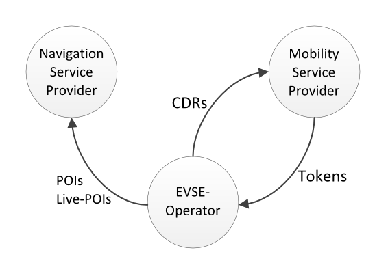

The exchange of data takes place via standardized web services.


## Exchange Authorisation Data


### Upload own authorisation data (roaming list) to the CHS

The MDM of each EVSP has to exchange the own authorisation data with the
Clearing House to share that data with EVSE Operators. The upload of the
own roaming list is done in the following way:

 * MDM sends the SetRoamingAuthorisationList.req PDU.
 * CHS responds with a SetRoamingAuthorisationList.conf PDU.


### Update own authorisation data (roaming list) in the CHS

For later updates of authorization data from the MDM to the Clearing
House and the EVSE Operators, only the changed entries (delta) have to
be transferred. The updated roaming list entries have to be sent the
following way:

 * MDM sends the UpdateRoamingAuthorisationList.req PDU.
 * CHS responds with a UpdateRoamingAuthorisationList.conf PDU.


### Download global roaming authorisation data from CHS

A CMS downloads the global authorisation data repository from the CHS.
The download of the global roaming list is done in the following way:

 * CMS sends the GetRoamingAuthorisationList.req PDU.
 * CHS responds with GetRoamingAuthorisationList.conf PDU.


### Download updates in global roaming authorisation data from CHS

A CMS downloads the changes to the global authorisation data repository
since the last synchronization from the CHS. The updates in the global
roaming list can be done in the following way:

 * CMS sends the GetRoamingAuthorisationListUpdates.req PDU.
 * CHS responds with GetRoamingAuthorisationListUpdates.conf PDU.


## Exchange Charge Data

The exchange of charge data is be done by sending records containing 
all billing information from the EVSE-Operator to corresponding the 
EVSP. The data set is called Charge Detail Record (CDR). Each CDR 
contains a status value that reflects the processing state of the 
record within the clearing house roaming connection. The status must 
not be set directly by the roaming partners' systems. The figure in the 
next section illustrates the status flow for each CDR.

##### CDR Validation Process
In bilateral agreed intervals, the EVSE-Operator or CDR-"Originator" 
sends all relevant CDRs to the Clearing House. A basic plausibility 
check is performed by the Clearing House and determines if the CDRs can 
be accepted. Implausible CDRs will directly be sent back to the 
CDR-"Originator" and can be adjusted. A corrected version of the CDR 
can again be uploaded to the Clearing House with the next call. Already 
uploaded CDRs will have the status *new* set by the Clearing House. 
Plausible CDRs will be marked as *accepted* and sent to the EV 
Service Provider or CDR-"Owner" for approval.
The CDR-"Owner" downloads in bilateral agreed intervals the list of 
CDRs from all providers. After a internal validation check in the 
backend, the EVSP uploads a list of approved and declined CDRs to the 
Clearing House. Approved CDRs will be marked as such and their status 
is set to *approved*. These CDRs will then be archived and are not 
available for download any more. Declined CDRs will be marked as 
*owner-declined*, an issue will be filed and the Clearing House will 
try to solve the issue. Upon manual revision the CDRs will be either 
marked as *approved* or *rejected* to be archived in the system. CDRs 
in status *owner-declined* are not available for download.

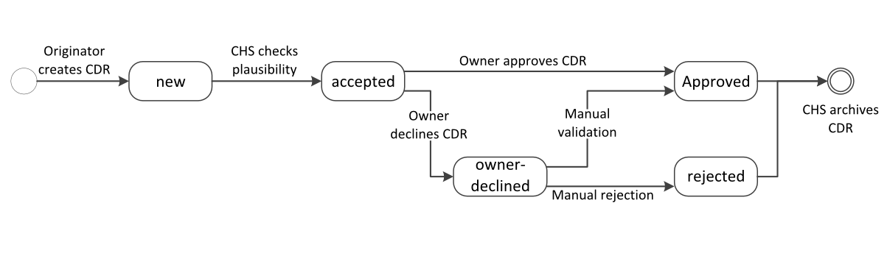


### Upload Charge Data Records

Local roaming charge data records are sent from the CMS to the CHS. The
upload has to be done in the following way:

 * CMS sends the AddCDRs.req PDU.
 * CHS responds with: AddCDRs.conf PDU.


### Process Charge Data Records

Incoming roaming charge data records, held at the CHS are sent from the
CHS to the MDM. Note that only CDRs that concern the particular EVSP are
sent. The download has to be done in the following way:

 * MDM sends GetCDRs.req PDU.
 * CHS responds with a GetCDRs.conf PDU.
 * MDM confirms or declines single CDRs with ConfirmCDRs.req
 * CHS responds with a ConfirmCDRs.conf PDU.


##### Implementation
All CDRs stay in the download queue until their successful download was
confirmed by a call to ConfirmCDRs.req. Declined CDRs may be handled in
a separate negotiation process as described before.


## Exchange Charge Point Information

For user information and routing purpose detailed information about charge
points can be exchanged via OCHP. The EVSE Operator sends this data
towards the systems of Navigation Service Providers. Those systems may
aggregate, sort and filter the data and provide it to the navigation
services or devices through proprietary interfaces within the NSP
ecosystem. Detailed information about the filtering of charge point
information can be found in the annex.


### Upload own charge point information to the CHS

Each CMS has to upload its own Charge point information to the Clearing
House. The upload of the own charge point information is done in the
following way:

 * CMS sends the SetChargePointList.req PDU.
 * CHS responds with a SetChargePointList.conf PDU.


### Download global charge point information from the CHS

A NPS downloads the global charge point information from the CHS. The
download of the global charge point information is done in the following
way:

 * NPS sends the GetChargePointList.req PDU.
 * CHS responds with GetChargePointList.conf PDU.


## Live Request for a single authorization

Live requests are sent from the EVSE-Operator backend to the clearing 
house in the event that the local repository of authorization records 
was not synchronized from the clearing house. The figure illustrates 
the steps during a charging session that is authorised live by the 
clearing house. During the authorisation for the start of the process 
the operator backend is requesting the clearing house via OCHP. The 
response contains the authorisation or rejection and a transaction ID. 
For the end of the charging process the operator backend is able to 
authorise the same token. For the later exchanged CDR the transaction 
ID of the single authorisation is to be used.

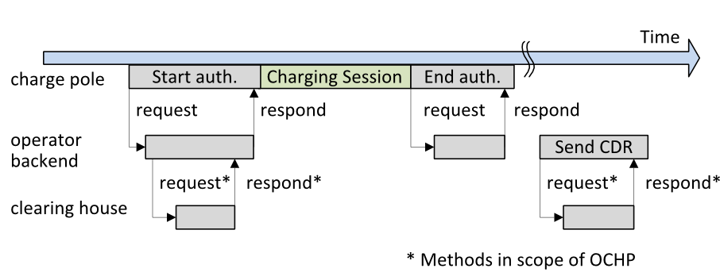


### Request the CHS to authorize one single token for roaming

A CMS may request the Clearing House to authorize one single token for a
charging session. The authorization is requested for a single EVSE-ID 
and a single token. Optional a ID for the single transaction can be 
added to track the issued CDR in the requester's numbering scheme. The 
request for authorization is done in the following
way:

 * CMS sends the RequestLiveRoamingAuthorisation.req PDU.
 * CHS responds with a RequestLiveRoamingAuthorisation.conf PDU.


## Live Status Interface

As additional status information to the static POI data of the Charge 
Point Information, the Live Status Interface builds upon that. Thus, 
live status data does only contain the status information of each EVSE 
without further payload data. A additional time to live can be 
specified until the status information may be considered as actual. 
Overdue status information will be dropped by the CHS. The Navigation 
System Providers are asked to request the actual status for stations 
without valid status information.
The current major and minor status of each EVSE shall be set following 
the decision flow in figure below.

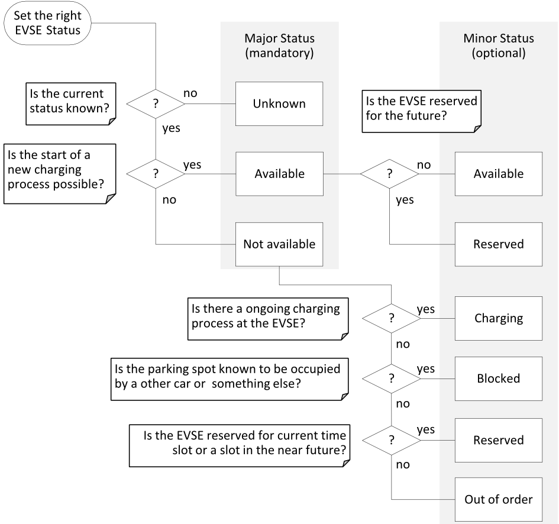

Table shows the relationship of the major and minor status values. 
Other combinations of the status values are must not be set.

Major Status  | Minor Status | Description
:-------------|:-------------|:-------------
Unknown       | n/a          | Operator can not reliably determine the current status. TTL is set to the time the next status update is expected, normally in near future.
Available     | Available    | A new charging process can be started immediately. TTL is set to the near future, normally five minutes ahead.
Available     | Reserved     | A new charging process can be started immediately but there is a reservation in the future. TTL is set to a date until when new charging processes may be started. Usually the status will change than to *Not Available--Reserved*.
Not Available | Charging     | Charging process ongoing, charge point occupied. No new charging process can be started. TTL is set to the expected end of the charging process. For example 20 minutes ahead for quick charging.
Not Available | Blocked      | Parking spot occupied w/o ongoing charging process. This may be caused by a parked car that is not ambiguous to charge. TTL is set to a date in the near future.
Not Available | Reserved     | Reserved for now or the near future, no new charging process may be started. TTL is set to the date the reservation will expire. Usually the status will change than to either *Not Available--Charging* or to *Available--Available* if the reservation was not used..
Not Available | Out Of Order | Failure or other inoperability. TTL is set to the expected end of the failure if known. In case of longer service interruptions, the charge point status value should also be set to *Inoperative*, see  [ChargePointStatusType](#ChargePointStatusType).


##### Implementation
Each status update from the sending operator must contain the major status and may contain a minor status for further details. Consuming Navigation System Providers must be able to process the three major status values. Optionally they may display the minor status and the ttl-value to the user.
The clearing house or every consuming system may drop status values with an expired ttl-value. The status of an EVSE must default to *unknown* in that case.
Consuming systems should request for new status updates whenever an loaded status value expires.


### Update the live status of the own stations in the CHS

A CMS may update the current live status of individual charging stations in the Clearing House to allow roaming partners to receive those statuses. The live status update is done in the following way:

 * CMS sends the UpdateStatus.req PDU.
 * CHS responds with a UpdateStatus.conf PDU.


### Download global live status information from the CHS

A NSP may receive the current live status of individual charging 
stations from the Clearing House. The live status download is done in 
the following way:

 * CMS sends the GetStatus.req PDU.
 * CHS responds with a GetStatus.conf PDU.


# Messages


## Messages for the Exchange of Authorisation Data

These messages are used for the purpose of the exchange of authorization data from an EVSP to an EVSE Operator.


### GetRoamingAuthorisationList.req

This contains the field definition of the GetRoamingAuthorisationList.req sent by a partner's system to the CHS.
No fields are defined.


### GetRoamingAuthorisationList.conf

This contains the field definition of the GetRoamingAuthorisationList.conf sent by the CHS as response to the GetRoamingAuthorisationList.req.

 Field Name                    |  Field Type                |  Card.  |  Description
:------------------------------|:---------------------------|:--------|:------------
result                         |  Result                    |  1      |  This contains the result of GetRoamingAuthorisationList.req.
roamingAuthorisationInfoArray  |  RoamingAuthorisationInfo  |  *      |  This contains the roaming authorisation records.


### SetRoamingAuthorisationList.req

This contains the field definition of the SetRoamingAuthorisationList.req sent by a partner's system to the CHS.

 Field Name                    |  Field Type                |  Card.  |  Description
:------------------------------|:---------------------------|:--------|:------------
roamingAuthorisationInfoArray  |  RoamingAuthorisationInfo  |  +      |  This contains the roaming authorisation records.


### SetRoamingAuthorisationList.conf

This contains the field definition of the SetRoamingAuthorisationList.conf sent by the CHS as response to the SetRoamingAuthorisationList.req.

 Field Name                      |  Field Type                |  Card.  |  Description
:--------------------------------|:---------------------------|:--------|:------------
result                           |  Result                    |  1      |  This contains the result of SetRoamingAuthorisationList.req.
refusedRoamingAuthorisationInfo  |  RoamingAuthorisationInfo  |  ?      |  This contains the roaming authorisation records that could not be set in the clearing house. For error description see the result message.


### GetRoamingAuthorisationListUpdates.req

This contains the field definition of the GetRoamingAuthorisationListUpdate.req sent by a partner's system to the CHS.

 Field Name   |  Field Type    |  Card.  |  Description
:-------------|:---------------|:--------|:------------
lastUpdate    |  DateTimeType  |  1      |  Date and time since the last successful call of GetRoamingAuthorisationList.req or GetRoamingAuthorisationListUpdate.req.


### GetRoamingAuthorisationListUpdates.conf

This contains the field definition of the GetRoamingAuthorisationListUpdate.conf sent by the CHS as response to the GetRoamingAuthorisationListUpdate.req.

 Field Name                    |  Field Type                |  Card.  |  Description
:------------------------------|:---------------------------|:--------|:------------
result                         |  Result                    |  1      |  This contains the result of GetRoamingAuthorisationListUpdate.req.
roamingAuthorisationInfoArray  |  RoamingAuthorisationInfo  |  *      |  This contains the roaming authorisation records changed since the time specified in lastUpdate in the request.


### UpdateRoamingAuthorisationList.req

This contains the field definition of the UpdateRoamingAuthorisationList.req sent by a partner's system to the CHS.

 Field Name                    |  Field Type                |  Card.  |  Description
:------------------------------|:---------------------------|:--------|:------------
roamingAuthorisationInfoArray  |  RoamingAuthorisationInfo  |  +      |  This contains the roaming authorisation records to be updated or added.


### UpdateRoamingAuthorisationList.conf

This contains the field definition of the UpdateRoamingAuthorisationList.conf sent by the CHS as response to the UpdateRoamingAuthorisationList.req.

 Field Name                      |  Field Type                |  Card.  |  Description
:--------------------------------|:---------------------------|:--------|:------------
result                           |  Result                    |  1      |  This contains the result of UpdateRoamingAuthorisationList.req.
refusedRoamingAuthorisationInfo  |  RoamingAuthorisationInfo  |  ?      |  This contains the roaming authorisation records that could not be set in the clearing house. For error description see the result message.


## Messages for the Exchange of Charge Data

These messages are used for the purpose of the exchange of charge data from an EVSE Operator to an EVSP.


### GetCDRs.req

This contains the field definition of the GetCDRs.req sent by a partner's system to the CHS.
No fields are defined.


### GetCDRs.conf

This contains the field definition of the GetCDRs.conf sent by the CHS as response to the GetCDRs.req.

 Field Name   |  Field Type      |  Card.  |  Description
:-------------|:-----------------|:--------|:------------
result        |  Result          |  1      |  This contains the result of GetCDRs.req.
cdrInfoArray  |  Array(CDRInfo)  |  *      |  This contains the CDRs that have been cleared (in the last call to ClearCDRs.req).


### AddCDRs.req

This contains the field definition of the AddCDRs.req sent by a partner's system to the CHS.

 Field Name   |  Field Type      |  Card.  |  Description
:-------------|:-----------------|:--------|:------------
cdrInfoArray  |  Array(CDRInfo)  |  +      |  This contains one or more Charge Detail Records.


### AddCDRs.conf

This contains the field definition of the AddCDRs.conf sent by the CHS as response to the AddCDRs.req.

 Field Name           |  Field Type      |  Card.  |  Description
:---------------------|:-----------------|:--------|:------------
result                |  Result          |  1      |  This contains the result of AddCDRs.req.
implausibleCdrsArray  |  Array(CDRInfo)  |  *      |  This contains the refused Charge Detail Records.


### ConfirmCDRs.req

This contains the field definition of the ConfirmCDRs.req sent by a partner's system to the CHS.

 Field Name   |  Field Type      |  Card.  |  Description
:-------------|:-----------------|:--------|:------------
approved      |  Array(CDRInfo)  |  *      |  This contains the CDRs that have been approved by the EVSP.
declined      |  Array(CDRInfo)  |  *      |  This contains the CDRs that have been declined by the EVSP.


### ConfirmCDRs.conf

This contains the field definition of the GetCDRs.conf sent by the CHS as response to the ConfirmCDRs.req.

 Field Name   |  Field Type  |  Card.  |  Description
:-------------|:-------------|:--------|:------------
result        |  Result      |  1      |  This contains the result of ConfirmCDRs.req.


## Messages for the Exchange of Charge Point Information

These messages are used for the purpose of the exchange of charge point information or POI data from an EVSE Operator to an NSP.


### GetChargePointList.req

This contains the field definition of the GetChargePointList.req sent by a partner's system to the CHS.
No fields are defined.


### GetChargePointList.conf

This contains the field definition of the GetChargePointList.conf sent by the CHS as response to the GetChargePointList.req.

 Field Name           |  Field Type       |  Card.  |  Description
:---------------------|:------------------|:--------|:------------
result                |  Result           |  1      |  This contains the result of GetRoamingAuthorisationList.req.
chargePointInfoArray  |  ChargePointInfo  |  *      |  This contains the charge point information records.


### SetChargePointList.req

This contains the field definition of the SetChargePointList.req sent by a partner's system to the CHS.

 Field Name           |  Field Type       |  Card.  |  Description
:---------------------|:------------------|:--------|:------------
chargePointInfoArray  |  ChargePointInfo  |  +      |  This contains the charge point information records.


### SetChargePointList.conf

This contains the field definition of the SetChargePointList.conf sent 
by the CHS as response to the SetChargePointList.req.

 Field Name             |  Field Type       |  Card.  |  Description
:-----------------------|:------------------|:--------|:------------
result                  |  Result           |  1      |  This contains the result of SetChargePointList.req.
refusedChargePointInfo  |  ChargePointInfo  |  ?      |  This contains the charge point information records that could not be set in the clearing house. For error description see the result message.


### GetChargePointListUpdates.req

This contains the field definition of the GetChargePointListUpdates.req 
sent by a partner's system to the CHS.

 Field Name   |  Field Type    |  Card.  |  Description
:-------------|:---------------|:--------|:------------
lastUpdate    |  DateTimeType  |  1      |  Date and time since the last successful call of GetChargePointList.req or GetChargePointListUpdates.req.


### GetChargePointListUpdates.conf

This contains the field definition of the GetChargePointListUpdates.conf 
sent by the CHS as response to the GetChargePointListUpdates.req.

 Field Name           |  Field Type       |  Card.  |  Description
:---------------------|:------------------|:--------|:------------
result                |  Result           |  1      |  This contains the result of GetChargePointListUpdates.req.
chargePointInfoArray  |  ChargePointInfo  |  *      |  This contains the charge point information records changed since the time specified in lastUpdate in the request.


### UpdateChargePointList.req

This contains the field definition of the UpdateChargePointList.req 
sent by a partner's system to the CHS.

 Field Name           |  Field Type       |  Card.  |  Description
:---------------------|:------------------|:--------|:------------
chargePointInfoArray  |  ChargePointInfo  |  +      |  This contains the charge point information records to be updated or added.


### UpdateChargePointList.conf

This contains the field definition of the UpdateChargePointList.conf 
sent by the CHS as response to the SetChargePointList.req.

 Field Name             |  Field Type       |  Card.  |  Description
:-----------------------|:------------------|:--------|:------------
result                  |  Result           |  1      |  This contains the result of UpdateChargePointList.req.
refusedChargePointInfo  |  ChargePointInfo  |  ?      |  This contains the charge point information records that could not be set in the clearing house. For error description see the result message.


## Messages for live authorisation


### RequestLiveRoamingAuthorisation.req

This contains the field definition of the 
RequestLiveRoamingAuthorisation.req sent by CMS to the CHS. A 
authorisation will always generate a unique cdrId to track the 
transaction. This ID can be generated by the operator or will be issued 
by the clearing house.

 Field Name   |  Field Type  |  Card.  |  Description
:-------------|:-------------|:--------|:------------
emtId         |  EmtId       |  1      |  This contains the ID of the token which is to be validated.
evseId        |  EvseId      |  1      |  Unique identifier for every EVSE following a common scheme with a major id-unit reflecting the country and the market partner issuing it.


### RequestLiveRoamingAuthorisation.conf

This contains the field definition of the 
RequestLiveRoamingAuthorisation.conf sent by the CHS as response to the 
RequestLiveRoamingAuthorisation.req.

 Field Name               |  Field Type                |  Card.  |  Description
:-------------------------|:---------------------------|:--------|:------------
result                    |  Result                    |  1      |  This contains the result of GetRoamingAuthorisationList.req.
roamingAuthorisationInfo  |  RoamingAuthorisationInfo  |  ?      |  This contains the roaming authorisation record for the requested token, if the request was valid.
liveAuthId                |  LiveAuthId                |  1      |  Unique ID of the live authorisation request to the clearing house. Must be used for the corresponding CDR to reference this request.


## Messages for the Live Status Interface


### UpdateStatus.req

This contains the field definition of the UpdateStatus.req sent by a CMS to the CHS.

 Field Name   |  Field Type      |  Card.  |  Description
:-------------|:-----------------|:--------|:------------
evse          |  EvseStatusType  |  *      |  This contains one EVSE id with the current status represented in a major part and a minor part.
ttl           |  DateTimeType    |  ?      |  The time to live is set as the deadline till the status values are to be considered valid, where not otherwise specified.


### UpdateStatus.conf

This contains the field definition of the UpdateStatus.conf sent by the CHS as response to the UpdateStatus.req.

 Field Name   |  Field Type  |  Card.  |  Description
:-------------|:-------------|:--------|:------------
result        |  Result      |  1      |  This contains the result of UpdateStatus.req.


### GetStatus.req

This contains the field definition of the GetStatus.req sent by a NPS to the CHS.

 Field Name    |  Field Type    |  Card.  |  Description
:--------------|:---------------|:--------|:------------
startDateTime  |  DateTimeType  |  ?      |  If this value is set to a point in the past the response is limited to status information that is more actual than the given value.


### GetStatus.conf

This contains the field definition of the GetStatus.conf sent by the CHS as response to the GetStatus.req.

 Field Name   |  Field Type      |  Card.  |  Description
:-------------|:-----------------|:--------|:------------
evse          |  EvseStatusType  |  *      |  This contains one EVSE id with the current status represented in a major part and a minor part.


# Types

The defined types have either to be filled with a valid value or - where allowed - left out in the SOAP tree.


## General Types

These data types are used in two or more use cases of this protocol.


### Result *class*

Contains result information.

 Field Name         |  Field Type      |  Card.  |  Description
:-------------------|:-----------------|:--------|:------------
 resultCode         |  resultCodeType  |  1      |  The machine-readable result code.
 resultDescription  |  string          |  1      |  The human-readable error description.


### ResultCodeType *enum*

Result and error codes for the class Result as return value for method calls.

 Value          |  Description
:---------------|:-------------
 ok             | Data accepted and processed; 
 partly         | Only part of the data was accepted; 
 not-authorized | Wrong username and/or password.
 invalid-id     | One or more ID (EVSE/Contract) were not valid for this user.
 server         | Internal server error.


### DateTimeType

Format is according to ISO8601 UTC. The field takes 20 alphanumeric
characters.

###### Example

```
2011-06-01T11:45:30Z
```


###### Regular Expression

```regex
(\d\d\d\d)-(\d\d)-(\d\d)T(\d\d):(\d\d):(\d\d)Z
```


### LocalDateTimeType

Format is according to ISO8601 UTC + Offset. The field takes 25 
alphanumeric characters.

Please note that this type does explicitly not take UTC times. All time 
values need to be given in local time with a valid offset. A time value 
with $+0000$ offset represents the Greenwich Mean Time and is 
semantically not the same as UTC.

###### Example

```
2011-06-01T11:45:30+02:00
```


###### Regular Expression

```regex
(\d\d\d\d)-(\d\d)-(\d\d)T(\d\d):(\d\d):(\d\d)([+\-]\d\d):(\d\d)
```


## Types for the Exchange of Authorisation Data

These data types are used for the purpose of the exchange of
authorisation data from an EVSP to an EVSE Operator.


### ContractId (or EVCO-ID)

The data type ContractId must follow the specification for EMAID in
*ISO/IEC 15118-2 - Annex H "Specification of Identifiers"*.
The check digit is optional but highly recommended. For calculation see
the annex.
The EMAID must match the following structure (the notation corresponds
to the augmented Backus-Naur Form (ABNF) as defined in RFC 5234):

```ABNF
<ContractID> = <Country Code> <S> <Provider ID> <S> <Instance> <S> <Check Digit>
<Country Code> = 2 ALPHA
    ; two character country code according to ISO 3166-1 (Alpha-2-Code)
<Provider ID> = 3 (ALPHA / DIGIT)
    ; three alphanumeric characters, defined and listed by eMI3 group
<Instance> = 9 (ALPHA / DIGIT)
    ; nine alphanumeric characters
<Check Digit> = *1 (ALPHA / DIGIT)
    ; Optional but highly recommended, see subclause H.1.3 for its computation
ALPHA = %x41-5A / %x61-7A
    ; according to IETF RFC 5234(7-Bit ASCII)
DIGIT = %x30-39
    ; according to IETF RFC 5234 (7-Bit ASCII)
<S> = *1 ( "-" )
    ; optional separator
```

An example for a valid EMAID therefore is `DE8AACA2B3C4D5N` or with dashes
`DE-8AA-CA2B3C4D5-N`.

###### Contract-ID Semantics
The following rules apply:

 * The Contract-ID must be interpreted case insensitive.
 * A hyphen ("-") can be used as separator in communication with 
   users to allow better reading, spelling and typing. An example for such
   an illustration is `DE-8AA-CA2B3C4D5-N`. If the hyphenated representation
   is chosen, the separators must be set at all three places.
 * Each Contract-ID has a fixed length of at least fourteen and at
   most fifteen characters excluding the optional hyphens or seventeen
   respectively eighteen characters including the optional separators.
 * While the Provider ID must be assigned by a central issuing
   authority, each provider with an assigned Provider ID can chose the eMA
   Instance within the above mentioned rules freely.


###### Backward Compatibility
Contract IDs as defined in DIN SPEC 91286 may be used as well by adding
two zeros ("00") at the beginning of the Instance-part and the old
check digit at position 14. A second check digit as referenced in this
document may be calculated over the resulting ID and may be added on
position 15.
Example: The DIN-Contract-ID `DE-8AA-123A56-3` must be set as EMAID 
`DE-8AA-00123A563-N`.

###### ID-Structure
One Contract-ID (ContractId) may refer to several Token-IDs (EmtId).
This reflects the situation that one contractual user account can be
authorized by different tokens. The structure can be illustrated as
shown in this figure:

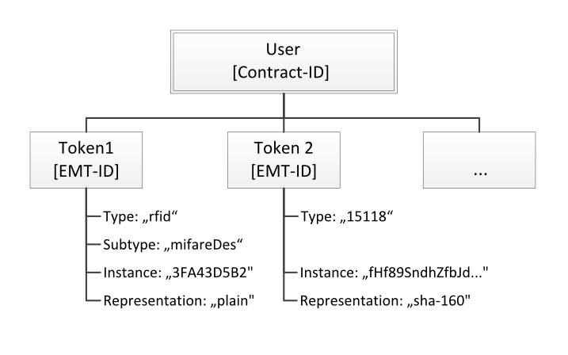


### EmtId *class*

The authorisation tokens are defined according to the specification of
the EMT-ID (Token ID). Each token consists of an token instance which
holds the payload and at least the token type. The sub-type is for
further specification of the general token type.

 Field Name      |  Field Type           |  Card.  |  Description
:----------------|:----------------------|:--------|:------------
 instance        |  string(512)          |  1      |  Specification according to the token type.
 representation  |  tokenRepresentation  |  1      |  The token instance may be represented by its hash value (hexadecimal representation of the hash value). This specifies in which representation the token instance is set.
 type            |  tokenType            |  1      |  The type of the supplied instance.
 subType         |  tokenSubType         |  ?      |  The exact type of the supplied instance.


### tokenType *enum*

The type of the supplied instance for basic filtering.

 Value       |  Description
:------------|:-------------
 rfid        |  All kinds of RFID-Cards. Field tokenInstance holds the hexadecimal representation of the card's UID, Byte order: big endian, no zero-filling.
 remote      |  All means of remote authentication through the backend.
 15118       |  All authentication means defined by ISO/IEC 15118 except RFID-cards.


### tokenSubType *enum*

The exact type of the supplied instance for referencing purpose.

 Value       |  Description
:------------|:-------------
 mifareCls   |  Mifare Classic Card
 mifareDes   |  Mifare Desfire Card
 calypso     |  Calypso Card


### tokenRepresentation *enum*

Specifies the representation of the token to allow hashed token values.

 Value       |  Description
:------------|:-------------
 plain       |  The token instance is represented in plain text.
 sha-160     |  The token instance is represented in its 160bit SHA1 hash in 40 hexadecimal digits. (default)
 sha-256     |  The token instance is represented in its 256bit SHA2 hash in 64 hexadecimal digits.

###### eMT-ID Semantics
The EMT ID can be used to identify any identification token for
e-mobility. The EMT ID is a non-global ID and therefore has no country
code or operator/provider part. This information about the "owning
operator/provider" is delivered by the context of the communication.


### RoamingAuthorisationInfo *class*

Contains information about a roaming authorisation (card/token)

 Field Name     |  Field Type    |  Card.  |  Description
:---------------|:---------------|:--------|:------------
 EmtId          |  EmtId         |  1      |  Electrical Vehicle Contract Identifier
 contractId     |  ContractId    |  1      |  EMA-ID the token belongs to.
 printedNumber  |  string(150)   |  ?      |  Might be used for manual authorisation.
 expiryDate     |  DateTimeType  |  1      |  Tokens may be used until the date of expiry is reached. To be handled by the partners systems. Expired roaming authorisations may be erased locally by each partner's systems.


## Types for the Exchange of Charge Data

These data types are used for the purpose of the exchange of charge data
from an EVSE Operator to an EVSP.


### BillingItemType *enum*

The billing items for charging periods.

 Value        |  Description
:-------------|:-------------
 parkingtime  |  Price for the time of parking. The billingValue represents the time in hours.
 usagetime    |  Price for the time of EVSE usage. The billingValue represents the time in hours.
 energy       |  Price for the consumed energy. The billingValue represents the energy in kilowatt-hours.
 power        |  Price for the used power level. The billingValue represents the maximum power in kilowatts.
 serviceFee   |  General service fee per charging process. The billingValue represents multiplier and thus has to be set to "1.0".


### CdrPeriodType *class*

This class defines one time and billing period in the charge detail
record. Two periods may overlap in time. Each period represents one
billing item of the charging process.
The value *periodCost* is optional and can be calculated from the
other values in the period. The calculation of this total cost of one
charging period is calculated the following way:

periodCost = billingValue * itemPrice [currency]

Therefore the total cost _C_ of a charging process and thus the value
that has to be paid to the operator is calculated by summung up all
period prices:

C = sum( billingValue_i * itemPrice_i ) [currency]

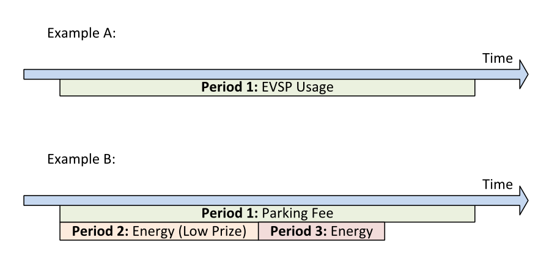

 Field Name     |  Field Type         |  Card.  |  Description
:---------------|:--------------------|:--------|:------------
 startDateTime  |  LocalDateTimeType  |  1      |  Starting time of the period. Must be equal or later than startDateTime of the CDRInfo.
 endDateTime    |  LocalDateTimeType  |  1      |  Ending time of the period. Must be equal or earlier than endDateTime of the CDRInfo.
 billingItem    |  BillingItemType    |  1      |  Defines what the EVSP is charged for during this period.
 billingValue   |  float              |  1      |  The value the EVSP is charged for. The unit of this value depends on the billingItem.
 currency       |  string(3)          |  1      |  Alphabetic. The displayed and charged currency. Defined in ISO 4217 - Table A.1, alphabetic list.
 itemPrice      |  float              |  1      |  Price per unit of the billingItem in the given currency.
 periodCost     |  float              |  ?      |  Total cost of the period in the given currency.

###### Implementation
Different prices for the individual parts of the pricing model can
be reflected by adding multiple periods to one CDR. There are
various possible combinations of periods to reflect different pricing
models. Some examples:

 * There could be a higher price for the first 30 minutes, followed
   by a lower price. This requires two pricing periods, one for each
   price level.
 * Another operator could charge a start fee per charging session
   plus the energy price per kilowatt hour. This requires two periods,
   one of type *serviceFee* and one of type *energy*, both
   covering the full length of the charging process.
 * Not all roaming relations require rated charge data. If not
   needed, the *itemPrice* may be set to 0 (zero) to explicitly
   reflect a roaming process that will not be charged by the operator.


### CdrStatusType *enum*

Reflects the current status of the CDR. This is reflecting the status
of internal processing in the clearing house. The value must not be
changed by the partner's systems directly. Implicit changes are made
while uploading, approving or declining CDRs.

 Value           |  Description
:----------------|:-------------
 new             |  A new CDR before upload to the CHS.
 accepted        |  An uploaded CDR was accepted by the CHS as plausible.
 rejected        |  The checked CDR again rejected by the CHS and is to be archived.
 owner declined  |  The CDR was declined by the owner (EVSP).
 approved        |  The CDR was approved by the owner (EVSP). 


### CDRInfo *class*

Contains all information concerning a Charge Data Record

 Field Name       |  Field Type         |  Card.  |  Description
:-----------------|:--------------------|:--------|:------------
 cdrId            |  string(36)         |  1      |  Alphanumeric, Charge Data Record number. Unique per EVSE-ID. Characters: $[$A-Z$]$, $[$0-9$]$
 evseId           |  EvseId             |  1      |  Unique identifier for every EVSE following a common scheme with a major id-unit reflecting the country and the market partner issuing it.
 emtId            |  EmtId              |  1      |  Utilized token for this charging session.
 contractId       |  ContractId         |  1      |  Identifies a customer in the electric mobility charging context.
 liveAuthId       |  LiveAuthId         |  ?      |  References a live authorisation request to the clearing house. Must be specified if the charging process was authorized by the clearing house directly in a call to RequestLiveRoamingAuthorisation.
 status           |  CdrStatusType      |  1      |  Current status of the CDR. Must be set to "new" by the issuing CMS. Shall not be changed by any partner but only by the CHS.
 startDateTime    |  LocalDateTimeType  |  1      |  Start date and time of the charge session (login with the RFID badge). Local time of the charge point is used.
 endDateTime      |  LocalDateTimeType  |  1      |  End date and time of the charge session (log-off with the RFID badge or physical disconnect). Must be set in the local time of the charge point.
 duration         |  string(9)          |  ?      |  Duration of the charge session. Example: "000:00:28"
 houseNumber      |  string(6)          |  ?      |  Hose number at the location of the charge point. Alphanumeric, for example "10","255B"
 address          |  string(45)         |  ?      |  Street of the location of the charge point. Optionally also containing the house number if not in field houseNumber.
 zipCode          |  string(10)         |  ?      |  Where available the ZIP code of the location of the charge point.
 city             |  string(45)         |  ?      |  City of the location of the charge point.
 country          |  string(3)          |  1      |  Country of the location of the charge point. Format is according to the three- character ISO-3166 code.
 chargePointType  |  string(2)          |  1      |  The type of the charge point "AC" or "DC"
 connectorType    |  ConnectorType      |  1      |  Type of the utilized socket or connector.
 maxSocketPower   |  float              |  1      |  Maximum available power at the socket in kilowatts. Example: "3.7", "11", "22"
 productType      |  string(2)          |  ?      |  Identifies the type of the product that was delivered for the charging session. Custom product code.
 meterId          |  string(20)         |  ?      |  Written identification number of the physical energy meter, provided by the manufacturer. For future use.
 chargingPeriods  |  CdrPeriodType      |  +      |  One period per item on the bill. At the moment only one period is to be provided.


## Types for the Exchange of Charge Point Information

These data types are used for the purpose of the exchange of charge
point information or POI data from an EVSE Operator to an NSP.


### EvseId

The EVSEID must follow the specification of _ISO/IEC 15118-2 - Annex H "Specification of Identifiers"_.
The EVSEID must match the following structure (the notation corresponds
to the augmented Backus-Naur Form (ABNF) as defined in RFC5234):

```ABNF
<EVSEID> = <Country Code> <S> <EVSE Operator ID> <S>
<ID Type> <Power Outlet ID>
<Country Code> = 2 ALPHA
    ; two character country code according to ISO 3166-1 (Alpha-2-Code)
<EVSE Operator ID> = 3 (ALPHA / DIGIT)
    ; three alphanumeric characters, defined and listed by eMI3 group
<ID Type> = "E"
    ; one character "E" indicating that this ID represents an "EVSE"
<Power Outlet ID> = (ALPHA / DIGIT) *30 (ALPHA / DIGIT / <S>)
    ; sequence of alphanumeric characters or separators, start with alphanumeric character
ALPHA = %x41-5A / %x61-7A
    ; according to IETF RFC 5234 (7-Bit ASCII)
DIGIT = %x30-39
    ; according to IETF RFC 5234 (7-Bit ASCII)
<S> = *1 ( "*" )
    ; optional separator
```

An example for a valid EVSEID is FR*A23*E45B*78C with FR indicating
France, A23 representing a particular EVSE Operator, E indicating that
it is of type EVSE and 45B*78C representing one of its power outlets.
EVSEID Semantics

The following rules apply:

 * Each EVSEID has a variable length with at least seven characters
   (two characters Country Code, three characters EVSE Operator ID, one
   character ID Type, one character Power Outlet ID) and at most
   thirty-seven characters (two characters Country Code, three characters
   EVSE Operator ID, one character ID Type, thirty-one characters Power
   Outlet ID).
 * While the EVSE Operator ID shall be assigned by a central issuing
   authority, each operator with an assigned EVSE Operator ID can choose
   the Power Outlet ID within the above mentioned rules freely.


###### Backward Compatibility
EVSE-IDs as defined in DIN SPEC 91286 MAY be used by applying the
following mapping:

 * The two digit country code "49" in Germany for geographic areas in 
   ITU-T E.164:11/2010 is mapped onto the ISO-3166-1 (Alpha-2-Code).
 * The three digit of spot operator ID is mapped 1:1 into the new 
   alphanumeric scheme.
 * All digits are mapped 1:1 into the new alphanumeric scheme.

###### Example
`+49*823*1234*5678` is interpreted as `DE*823*E1234*5678`


### evseImageUrlType *class*

This class references images related to a EVSE in terms of a file name 
or uri. According to the roaming connection between one EVSE Operator 
and one or more Navigation Service Providers the hosting or file 
exchange of image payload data has to be defined. The exchange of this 
content data is out of scope of OCHP. However, the recommended setup is 
a public available web server hosted and updated by the EVSE Operator. 
Per charge point a unlimited number of images of each type is allowed. 
Recommended are at least two images where one is a network or provider 
logo and the second is a station photo. If two images of the same type 
are defined they should be displayed additionally, not optionally.

###### Photo Dimensions
The recommended dimensions for all photos are minimum 800 pixels wide 
and 600 pixels height. Thumbnail representations for photos should 
always have the same orientation than the original with a size of 200 
to 200 pixels.

###### Logo Dimensions
The recommended dimensions for logos are exactly 512 pixels wide and 
512 pixels height. Thumbnail representations for logos should be 
exactly 128 pixels in with and height. If not squared, thumbnails 
should have the same orientation than the original.

 Field Name  |  Field Type   |  Card.  |  Description
:------------|:--------------|:--------|:------------
 uri         |  string(255)  |  1      |  uri from where the image data can be fetched. Must begin with a protocol of the list: http, https, file, ftp. Regex: <code>[A-Za-z][A-Za-z0-9\+\.\-]*:([A-Za-z0-9\.\-\_~:/\?\#\[\]@!\\\&'\(\)\*\+,;=]&#124;%[A-Fa-f0-9]\{2\})+\</code>
 thumbUri    |  string(255)  |  ?      |  uri from where a thumbnail of the image can be fetched. Must begin with a protocol of the list: http, https, file, ftp
 class       |  ImageClass   |  1      |  Image class for usage categorization
 type        |  string(4)    |  1      |  Image type like: gif, jpeg, png, svg
 width       |  int(5)       |  ?      |  Width of the full scale image
 height      |  int(5)       |  ?      |  Height of the full scale image


### ImageClass *enum*

The class of a EVSE image to obtain the correct usage in an user presentation. Has to be set accordingly to the image content in order to guaranty the right usage.

 Value         |  Description
:--------------|:-------------
 networkLogo   |  logo of a associated roaming network to be displayed with the EVSE for example in lists, maps and detailed information view
 operatorLogo  |  logo of the charge points operator, for example a municipal, to be displayed with the EVSEs detailed information view or in lists and maps, if no networkLogo is present
 ownerLogo     |  logo of the charge points owner, for example a local store, to be displayed with the EVSEs detailed information view
 stationPhoto  |  full view photo of the station in field. Should show the station only
 locationPhoto |  location overview photo. Should indicate the location of the station on the site or street.
 entrancePhoto |  location entrance photo. Should show the car entrance to the location from street side
 otherPhoto    |  other related photo to be displayed with the stations detailed information view
 otherLogo     |  other related logo to be displayed with the stations detailed information view
 otherGraphic  |  other related graphic to be displayed with the stations detailed information view 


### GeoPointType *class*

This class defines a geo location. The geodetic system to be used is WGS 84.

 Field Name  |  Field Type  |  Card.  |  Description
:------------|:-------------|:--------|:------------
 lat         |  string(10)  |  1      |  Latitude of the point in decimal degree. Example: 50.770774. Decimal separator: "." Regex: `-?$[$0-9$]$\{1,2\}$\$.$[$0-9$]$\{6\}`
 lon         |  string(11)  |  1      |  Longitude of the point in decimal degree. Example: -126.104965. Decimal separator: "." Regex: `-?$[$0-9$]$\{1,3\}$\$.$[$0-9$]$\{6\}`


### GeoPointType *class*

This class defines a geo location. The geodetic system to be used is WGS 84.

 Field Name  |  Field Type  |  Card.  |  Description
:------------|:-------------|:--------|:------------
 lat         |  string(10)  |  1      |  Latitude of the point in decimal degree. Example: 50.770774. Decimal separator: "." Regex: `-?$[$0-9$]$\{1,2\}$\$.$[$0-9$]$\{6\}`
 lon         |  string(11)  |  1      |  Longitude of the point in decimal degree. Example: -126.104965. Decimal separator: "." Regex: `-?$[$0-9$]$\{1,3\}$\$.$[$0-9$]$\{6\}`
 name        |  string(255) |  ?      |  Name of the point in local language or as written at the location. For example the street name of a parking lot entrance or it's number.
 class       |  GeoClass    |  1      |  The class of this geo point  for categorization and right usage.


### GeoClassType *enum*

Where the type-enum can be one of the following choices:

 Value       |  Description
:------------|:-------------
 entrance    |  For larger sites entrances may be specified for navigation.
 exit        |  For larger sites exits may be specified for navigation purpose.
 access      |  Two directional entrance and exit.
 ui          |  Geographical location of the user interface for authorisation and payment means. If not specified the user interface is assumed to be at the location of the charge point.
 other       |  Other relevant point. Name recommended.


### ConnectorStandard *enum*

The socket or plug standard of the charging point.

 Value                 |  Description
:----------------------|:-------------
 Chademo               |  The connector type is CHAdeMO, DC
 IEC-62196-T1          |  IEC 62196 Type 1 "SAE J1772"
 IEC-62196-T1-COMBO    |  Combo Type 1 based, DC
 IEC-62196-T2          |  IEC 62196 Type 2 "Mennekes"
 IEC-62196-T2-COMBO    |  Combo Type 2 based, DC
 IEC-62196-T3A         |  IEC 62196 Type 3A
 IEC-62196-T3C         |  IEC 62196 Type 3C "Scame"
 DOMESTIC-A            |  Standard/Domestic household, type "A", NEMA 1-15, 2 pins
 DOMESTIC-B            |  Standard/Domestic household, type "B", NEMA 5-15, 3 pins
 DOMESTIC-C            |  Standard/Domestic household, type "C", CEE 7/17, 2 pins
 DOMESTIC-D            |  Standard/Domestic household, type "D", 3 pin
 DOMESTIC-E            |  Standard/Domestic household, type "E", CEE 7/5 3 pins
 DOMESTIC-F            |  Standard/Domestic household, type "F", CEE 7/4, Schuko, 3 pins
 DOMESTIC-G            |  Standard/Domestic household, type "G", BS 1363, Commonwealth, 3 pins
 DOMESTIC-H            |  Standard/Domestic household, type "H", SI-32, 3 pins
 DOMESTIC-I            |  Standard/Domestic household, type "I", AS 3112, 3 pins
 DOMESTIC-J            |  Standard/Domestic household, type "J", SEV 1011, 3 pins
 DOMESTIC-K            |  Standard/Domestic household, type "K", DS 60884-2-D1, 3 pins
 DOMESTIC-L            |  Standard/Domestic household, type "L", CEI 23-16-VII, 3 pins
 TESLA-R               |  Tesla Connector "Roadster"-type (round, 4 pin)
 TESLA-S               |  Tesla Connector "Model-S"-type (oval, 5 pin)
 IEC-60309-2-single-16 |  IEC 60309-2 Industrial Connector single phase 16 Amperes (usually blue)
 IEC-60309-2-three-16  |  IEC 60309-2 Industrial Connector three phase 16 Amperes (usually red)
 IEC-60309-2-three-32  |  IEC 60309-2 Industrial Connector three phase 32 Amperes (usually red)
 IEC-60309-2-three-64  |  IEC 60309-2 Industrial Connector three phase 64 Amperes (usually red)


### ConnectorFormat *enum*

The format of the connector, whether it is a socket or a plug.

 Value       |  Description
:------------|:-------------
 Socket      |  The connector is a socket; the EV user needs to bring a fitting plug.
 Cable       |  The connector is a attached cable; the EV users car needs to have a fitting inlet.


### ConnectorType *class*

This class defines a power outlet at an EVSE in terms of its connector
standard and format (socket/cable).

 Field Name        |  Field Type            |  Card.  |  Description
:------------------|:-----------------------|:--------|:------------
 connectorStandard |  ConnectorStandardType |  1      |  The standard of the installed connector.
 connectorFormat   |  ConnectorFormatType   |  1      |  The format (socket/cable) of the installed connector.


### AuthMethodType *enum*

The authorisation and payment methods available at an EVSE for the EV user

 Value            |  Description
:-----------------|:-------------
 Public           |  Public accessible, no authorisation required.
 LocalKey         |  A key or access token can be received at the location. (i.e. at the hotel reception or in the restaurant)
 DirectCash       |  The EVSE can be accessed through direct payment in cash.
 DirectCreditcard |  The EVSE can be accessed through direct payment with credit card.
 DirectDebitcard  |  The EVSE can be accessed through direct payment with debit card.
 RfidMifareCls    |  Personal RFID token with roaming relation. (Mifare classic)
 RfidMifareDes    |  Personal RFID token with roaming relation. (Mifare Desfire)
 RfidCalypso      |  Personal RFID token with roaming relation. (Calypso)
 Iec15118         |  In-car access token as specified in IEC-15118. 


### ChargePointStatusType *enum*

This value represents the overall status of a charging point. Not to be
confused with a live status (available, reserved, occupied, ... ) This 
overall status should reflect situations which are valid over several 
days. The live status indicates shorter valid status.

 Value       |  Description
:------------|:-------------
 Unknown     |  No status information available
 Operative   |  charge point is in operation and can be used
 Inoperative |  charge point cannot be used due to maintenance, greater 
 downtime, blocking construction works or other access restrictions (temporarily, will be operative in the future).
 Planned     |  planned charge point, will be operating soon
 Closed      |  discontinued charge point, will be deleted soon 


### ChargePointScheduleType *class*

This type is used to schedule status periods in the future. The NSP can
provide this information to the EV user for trip planning purpose. A
period MAY have no end. Example: "This station will be running from
tomorrow. Today it is still planned and under construction."

 Field Name  |  Field Type           |  Card.  |  Description
:------------|:----------------------|:--------|:------------
 startDate   |  DateTimeType         |  1      |  Begin of the scheduled period.
 endDate     |  DateTimeType         |  ?      |  End of the scheduled period, if known.
 status      |  ChargePointStatusType|  1      |  Status value during the scheduled period.


### HoursType *class*

Opening and access hours for the charge point.

 Field Name             |  Field Type             |  Card.  |  Description
:-----------------------|:------------------------|:--------|:------------
 *Choice: one of two*   |                         |         | 
  > regularHours        |  regularHoursType       |  *      |  Regular hours, weekday based. Should not be set for representing 24/7 as this is the most common case.
  > twentyfourseven     |  boolean                |  1      |  True to represent 24 hours per day and 7 days per week, except the given exceptions.
 exceptionalOpenings    |  exceptionalPeriodType  |  *      |  Exceptions for specified calendar dates, time-range based. Periods the station is operating/accessible. Additional to regular hours. May overlap regular rules.
 exceptionalClosings    |  exceptionalPeriodType  |  *      |  Exceptions for specified calendar dates, time-range based. Periods the station is not operating/accessible. Overwriting regularHours and exceptionalOpenings. Should not overlap exceptionalOpenings.

###### Example one
Operating 24/7 except for New Year 2015:

```XML
<operatingTimes>
   <twentyfourseven>true</twentyfourseven>
   <exceptionalClosings>
	  <periodBegin>
		 <DateTime>2015-01-01T00:00:00Z</DateTime>
	  </periodBegin>
	  <periodEnd>
		 <DateTime>2015-01-02T00:00:00Z</DateTime>
	  </periodEnd>
   </exceptionalClosings>
</operatingTimes>
```


###### Example two
Operating on Weekdays from 8am till 8pm with one exceptional opening on
22/6/2014 and one exceptional closing the Monday after:

```XML
<operatingTimes>
     <regularHours weekday="1" periodBegin="08:00" periodEnd="20:00">
     <regularHours weekday="2" periodBegin="08:00" periodEnd="20:00">
     <regularHours weekday="3" periodBegin="08:00" periodEnd="20:00">
     <regularHours weekday="4" periodBegin="08:00" periodEnd="20:00">
     <regularHours weekday="5" periodBegin="08:00" periodEnd="20:00">
     <exceptionalOpenings
         periodBegin="2014-06-21T09:00:00Z" periodEnd="2014-06-21T12:00:00Z">
     <exceptionalClosings
         periodBegin="2014-06-24T00:00:00Z" periodEnd="2014-06-25T00:00:00Z">
</operatingTimes>
```

This represents the following schedule, where ~~stroked out~~ days are without operation hours, **bold** days are where exceptions apply and regular displayed days are where the regular schedule applies.


| Weekday   | Mo | Tu | We | Th | Fr | Sa     | Su     | Mo | Tu         | We | Th | Fr | Sa     | Su     |
|-----------|----|----|----|----|----|--------|--------|----|------------|----|----|----|--------|--------|
| Date      | 16 | 17 | 18 | 19 | 20 | **21** | ~~22~~ | 23 | **~~24~~** | 25 | 26 | 27 | ~~28~~ | ~~29~~ |
| Open from | 08 | 08 | 08 | 08 | 08 | 09     | -      | 08 | -          | 08 | 08 | 08 | -      | -      |
| Open till | 20 | 20 | 20 | 20 | 20 | 12     | -      | 20 | -          | 20 | 20 | 20 | -      | -      |


### RegularHoursType *class*

Regular recurring operation or access hours

 Field Name   |  Field Type  |  Card.  |  Description
:-------------|:-------------|:--------|:------------
 weekday~     |  int(1)      |  1      |  Number of day in the week, from Monday (1) till Sunday (7)
 periodBegin~ |  string(5)   |  1      |  Begin of the regular period given in hours and minutes. Must be in 24h format with leading zeros. Example: "18:15". Hour/Minute separator: ":" Regex: $[$0-2$]$$[$0-9$]$:$[$0-5$]$$[$0-9$]$
 periodEnd~   |  string(5)   |  1      |  End of the regular period, syntax as for periodBegin. Must be later than periodBegin.


### ExceptionalPeriodType *class*

Specifies one exceptional period for opening or access hours.

 Field Name  |  Field Type  |  Card.  |  Description
:------------|:-------------|:--------|:------------
 periodBegin |  DateTimeType|  1      |  Begin of the exception.
 periodEnd   |  DateTimeType|  1      |  End of the exception.


### GeneralLocationType *enum*

Reflects the general type of the charge points location. May be used 
for user information.

 Value              |  Description
:-------------------|:-------------
 on-street          |  parking in public space
 parking-garage     |  multistorey car park
 underground-garage |  multistorey car park, mainly underground
 parking-lot        |  a cleared area that is intended for parking vehicles, i.e. at super markets, bars, etc.
 other              |  none of the given possibilities
 unknown            |  parking location type is not known by the operator


### ParkingRestrictionType *enum*

This value, if provided, represents the restriction to the parking spot
for different purposes.

 Value       |  Description
:------------|:-------------
 evonly      |  reserved parking spot for electric vehicles
 plugged     |  parking allowed only while plugged in (charging)
 disabled    |  reserved parking spot for disabled people with valid ID
 customers   |  parking spot for customers/guests only, for example in case of a hotel or shop
 motorcycles |  parking spot only suitable for (electric) motorcycles or scooters


### ChargePointInfo *class*

Contains information about the charge points.

 Field Name          |  Field Type               |  Card.  |  Description
:--------------------|:--------------------------|:--------|:------------
 evseId              |  EvseId                   |  1      |  Globally unique identifier
 locationId          |  string(15)               |  1      |  Alphanumeric. Identifies a location/pool of EVSEs. Unique within one EVSE Operator. Characters: [A-Z], [0-9], <space>
 timestamp           |  DateTimeType             |  ?      |  Recommended. Date and time of the latest data update for this ChargePointInfo. When set it must be updated if one of the values changed.
 locationName        |  string(100)              |  1      |  Official name; should be unique in the geographical area
 locationNameLang    |  string(3)                |  1      |  Alpha, three characters. ISO-639-3 language code defining the language of the location name
 images              |  evseImageUrlType         |  ?      |  Links to images related to the EVSE such as photos or logos.
 houseNumber         |  string(6)                |  ?      |  Alphanumeric, for example "10", "255B". Characters: [A-Z], [0-9], <space>
 address             |  string(45)               |  1      |  Alphanumeric, for example "Av. Saint-Jean". Optionally also containing the house number if not in field houseNumber.
 city                |  string(45)               |  1      |  Alphabetic, in the language defined in locationNameLang
 zipCode             |  string(10)               |  1      |  Alphanumeric, Examples: "60439", "8011 PK". Without leading country code. Characters: [A-Z], [0-9], -, <space>
 country             |  string(3)                |  1      |  Alpha, three characters. ISO 3166 country code
 chargePointLocation |  GeoPointType             |  1      |  Geographical location of the charge point itself (power outlet).
 relatedLocation     |  AdditionalGeoPointType   |  ?      |  Geographical location of related points relevant to the user.
 timeZone            |  string(255)              |  ?      |  One of IANA tzdata's __TZ__-values representing the time zone of the location. Examples: "Europe/Oslo", "Europe/Zurich". ([http://www.iana.org/time-zones](http://www.iana.org/time-zones))
 operatingTimes      |  HoursType                |  ?      |  The times the EVSE is operating and can be used for charging. Must not be provided if operating hours are unsure/unknown.
 accessTimes         |  HoursType                |  ?      |  The times the EVSE is accessible, if different from operatingTimes. For example if a car park is closed during the night. Must not be provided if access hours are unsure/unknown.
 status              |  ChargePointStatusType    |  ?      |  The current status of the charge point.
 statusSchedule      |  ChargePointScheduleType  |  *      |  Planned status changes in the future. If a time span matches with the current or displayed date, the corresponding value overwrites *status*.
 telephoneNumber     |  string(20)               |  ?      |  Numeric. Service hotline to be displayed to the EV user. Separators recommended. Characters: [0-9], -, <space>
 location            |  GeneralLocationType      |  1      |  The general type of the charge point location.
 floorLevel          |  string(4)                |  ?      |  Alphanumeric. Level on which the charging station is located (in garage buildings) in the locally displayed numbering scheme. Examples: "-2", "P-5", "+5". Characters: [A-Z], [0-9], -, +, /
 parkingSlotNumber   |  string(5)                |  ?      |  Alphanumeric. Locally displayed parking slot number. Examples: "10", "B25", "P-234". Characters: [A-Z], [0-9], -, +, /
 parkingRestriction  |  ParkingRestrictionType   |  *      |  Those parking restrictions apply to the parking spot.
 authMethods         |  AuthMethodType           |  +      |  List of available payment or access methods on site.
 connectors          |  ConnectorType            |  +      |  Which receptacle type is/are present for a power outlet.
 userInterfaceLang   |  string(3)                |  *      |  Alpha, three characters. Language(s) of the user interface or printed on-site instructions. *ISO-639-3* language code


## Types for live authorisation

The following types are used in the live authorisation methods. For referencing purpose the types may also be used in the Charge Detail Record.


### LiveAuthId *class*

Unique ID for one live authorisation request to the clearing house. 
Will be returned from a call to RequestLiveRoamingAuthorisation and 
must be sent back to the clearing house in the corresponding CDRInfo 
item.

 Field Name  |  Field Type  |  Card.  |  Description
:------------|:-------------|:--------|:------------
 liveAuthId  |  string(15)  |  1      |  Unique ID for one live authorisation request to the clearing house.

Additionally to the internal session ID that has to be issued by the 
operator to uniquely identify the charging process in the CDR, the 
*liveAuthId* is identifying the live authorisation session in the 
clearing house. Therefore the *liveAuthId* has be referenced in the CDR 
to close this session. The figure below illustrates the full exchange 
path of of both IDs.

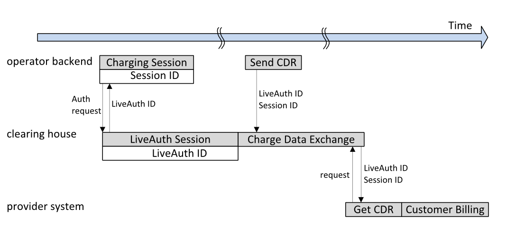


## Types for the Live Status Interface

These data types are used for the purpose of the exchange of live
status information in addition to the charge point information or
POI data from an EVSE Operator to an NSP.


### MajorType *enum*

The major status type reflects the overall status of the EVSE.

 Value          |  Description
:---------------|:-------------
 available      |  the EVSE is able to start a new charging process
 not-available  |  at the moment no new charging process may be started
 unknown        |  the current status of the EVSE is not known


### MinorType *enum*

The optional minor status type reflects the detailed status of
the EVSE in addition to the major status.
For each minor status value a proposed ttl value is given.
However, the ttl should only be set to a value other than
default if the expected status change is known or can be
predicted.

 Value       |  Description
:------------|:-------------
 available   |  the EVSE is able to start a new charging process
 reserved    |  the EVSE is able to start a new charging process for limited duration as a future reservation is present. ttl to be set on the start of the reservation when in future or to the end of the reservation else
 charging    |  the EVSE is in use. ttl to be set on the expected end of the charging process
 blocked     |  the EVSE not accessible because of a physical barrier, i.e. a car
 outoforder  |  the EVSE is currently out of order. ttl to be set to the expected re-enabling


### EvseStatusType *class*

Specifies the major and minor status of a EVSE.

 Field Name  |  Field Type    |  Card.  |  Description
:------------|:---------------|:--------|:------------
 evseId      |  EvseId        |  1      |  The EVSE the status is set for.
 major       |  MajorType     |  1      |  The major status value for the EVSE.
 minor       |  MinorType     |  ?      |  The minor status value for the EVSE.
 ttl         |  DateTimeType  |  ?      |  The time to live is set as the deadline till the status value is to be considered valid. Should be set to the expected status change.


# Binding to Transport Protocol

This section describes how the CHS PDUs can be conveyed over SOAP.
The rationale behind using SOAP as a transport is that SOAP already
provides the infrastructure of sending messages. SOAP has a good support
in the industry, which results in tools that improve the ease of
implementing the protocol.
For this protocol the SOAP Version 1.1 MUST be used.


## User Identification

Authentication must be done via WS-Security Username Token within the
SOAP Header. The Password is specified as "passwordText".
Example:

```XML
<soapenv:Envelope xmlns:ns="urn://stationoperator/charging/ws/2012/11/" xmlns:soapenv="http://schemas.xmlsoap.org/soap/envelope/">
<soapenv:Header>
<wsse:Security soapenv:mustUnderstand="1" xmlns:wsse="http://docs.oasis-open.org/wss/2004/01/oasis-200401-wss-wssecurity-secext-1.0.xsd">
<wsse:UsernameToken wsu:Id="UsernameToken-1" xmlns:wsu="http://docs.oasis-open.org/wss/2004/01/oasis-200401-wss-wssecurity-utility-1.0.xsd">
<wsse:Username>theUsername</wsse:Username>
<wsse:Password Type="http://docs.oasis-open.org/wss/2004/01/oasis-200401-wss-username-token-profile-1.0#PasswordText">thePassword</wsse:Password>
</wsse:UsernameToken>
</wsse:Security>
</soapenv:Header>
<soapenv:Body>...
```


# Annexes


## ID Validation and Transformation Tools


### Regular expression for EVSE-ID validation

This will match on a valid EVSE-ID. The positive look ahead at the very
end has to be changed depending on the usage or implementation.

###### Regular Expression

```regex
[A-Z]\{2\}(\*?)[A-Z0-9]\{3\}(?:\2)[E][A-Z0-9][A-Z0-9\*]\{0,30\}(?=\s)
```


### Regular expression for Contract-ID validation

This will match on a valid Contract-ID. The positive look ahead at the
very end has to be changed depending on the usage or implementation. The
check digit has to be validated in a separate step.

###### Regular Expression

```regex
[A-Za-z]\{2\}(-?)[A-Za-z0-9]\{3\}(?:\2)[Cc][A-Za-z0-9]\{9\}(?:(?:\2)[A-Za-z0-9])?(?=\s)
```


### Regular expression for Contract-ID normalization

This will remove the optional separators from a valid Contract-ID.

###### Regular Expression

```regex
([A-Za-z]\{2\})(-?)([A-Za-z0-9]\{3\})(?:\2)[Cc]([A-Za-z0-9]\{9\})(?:(?\2)([A-Za-z0-9]))?(?=\s)
```

```regex
\1\3\4\5\6
```


## List of examples for valid Contract-Ids

These are different possibilities for syntactically correct
Contract-IDs.

 ID-Example           | Description 
:---------------------|:------------
`DE-8AC-C12E456L89-Y` | Separators, Upper Case, Check Digit
`DE-8AC-C12E456L89`   | Separators, Upper Case
`de-8ac-c12e456l89-y` | Separators, Lower Case, Check Digit
`de-8ac-c12e456l89`   | Separators, Lower Case
`dE-8Ac-C12e456L89-y` | Separators, Mixed Case, Check Digit
`De-8aC-c12E456l89`   | Separators, Mixed Case
`DE8ACC12E456L89Y`    | Upper Case, Check Digit
`DE8ACC12E456L89`     | Upper Case
`de8acc12e456l89y`    | Lower Case, Check digit
`de8acc12e456l89`     | Lower Case
`dE8aCc12E456l89Y`    | Mixed Case, Check Digit
`De8AcC12e456L89`     | Mixed Case


## Data Field Mapping to OCPP


### Connector Types

 OCHP-Value            | OCPP-Value     | OCPP-Description                 
-----------------------|----------------|----------------------------------
 n/a                   | Avcon          | Avcon connector                  
 *multiple choices*    | Domestic       | Domestic plug                    
 n/a                   | IEC60309_2P    | 60309 Industrial 2P (DC)         
 n/a                   | IEC60309_3PE   | 60309 Industrial 3P + E (AC)     
 *multiple choices*    | IEC60309_3PEN  | 60309 Industrial 3P + E + N (AC) 
 IEC-60309-2-single-16 | IEC60309_PNE   | 60309 Industrial P + N + E (AC)  
 IEC-62196-T1          | IEC62196_1     | Type 1 Yazaki                    
 IEC-62196-T2          | IEC62196_2     | Type 2 Mennekes                  
 IEC-62196-T3C         | IEC62196_3     | Type 3 Scame                     
 n/a                   | LPI            | Large Paddle Inductive           
 n/a                   | NEMA5_20       |                                  
 IEC-62196-T1          | SAEJ1772       | Yazaki                           
 n/a                   | SPI            | Small Paddle Inductive           
 Chademo               | Tepco          | CHAdeMO fast charging            
 *multiple choices*    | Tesla          | Tesla connector                  
 n/a                   | Unspecified    |                                  
 IEC-62196-T1-COMBO    | n/a            | Not distinguished                
 IEC-62196-T2-COMBO    | n/a            | Not distinguished                
 IEC-62196-T3A         | n/a            | Not distinguished                
 DOMESTIC-A            | n/a            | Not distinguished                
 DOMESTIC-B            | n/a            | Not distinguished                
 DOMESTIC-C            | n/a            | Not distinguished                
 DOMESTIC-D            | n/a            | Not distinguished                
 DOMESTIC-E            | n/a            | Not distinguished                
 DOMESTIC-F            | n/a            | Not distinguished                
 DOMESTIC-G            | n/a            | Not distinguished                
 DOMESTIC-H            | n/a            | Not distinguished                
 DOMESTIC-I            | n/a            | Not distinguished                
 DOMESTIC-J            | n/a            | Not distinguished                
 DOMESTIC-K            | n/a            | Not distinguished                
 DOMESTIC-L            | n/a            | Not distinguished                
 TESLA-R               | n/a            | Not distinguished                
 TESLA-S               | n/a            | Not distinguished                
 IEC-60309-2-three-16  | n/a            | Not distinguished                
 IEC-60309-2-three-32  | n/a            | Not distinguished                
 IEC-60309-2-three-64  | n/a            | Not distinguished                


## EVSE Infrastructure Model

The interface described in this protocol is defined on EVSE level. 
However, there are more data structure layers to be considered in the 
connected systems. To allow for correct mapping to other data 
structures the following reference is provided.
Visualisations of different charging stations are given in the section 
below.


### Data Model Structure

The reference structure for charge point data is shown in the figure 
below. This hierarchical model maps the entities connector, charge 
point (or EVSE), charging station and EVSE Operator in four levels. The 
physical charge pole as a common casing for one multiple charge points 
is explicitly excluded from the model. The physical combination of 
multiple charge points in one pole is not affecting the logical 
relation of those. However, the attributes of the EVSE level may 
indicate to its existence when two EVSEs share a common user interface.

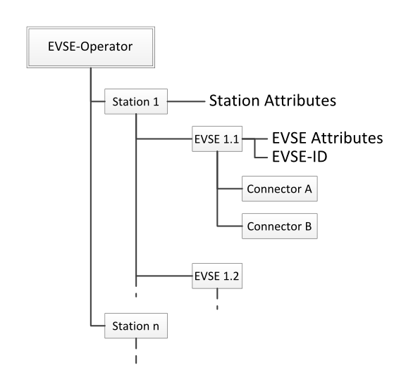

The architecture of the data model is based on the logical relations of 
the entities with a focus on the use cases for the EV user. The 
electrical connection of charge points, for example, is not influencing 
the data structure.
Each entity may have certain attributes attached. For the mapping to 
the OCHP data types and messages, the common attributes of parent 
entities are attached to the EVSE level. This results in repetitive 
data but allows maximum in flexibility.
Most noteworthy consequences from this data structure are the fact, 
that all EVSEs in one station should be managed by the same operator 
and that all charge points of one station should physically be situated 
in next to each other. It is also necessary that all Navigation Service 
Provider backends and data models are able to assign multiple 
connectors to one charge point.
Depending on the use case, different inheritance and aggregation of 
attributes is possible or may be necessary. For example requires the 
search for a available charging station to find one single available 
EVSE, what is relatively simple with the flat OCHP data model. If in 
another use case the search for a station with at least two available 
EVSEs is required, a aggregation of the data to the station level might 
be useful.
Please note that other layers might exist or be added in the future.


### Examples

In order to visualize the different possible situations of supply 
equipment, this section contains some examples. Of course not all 
possible cases can be reflected. As OCHP is not modelling the full data 
structure but only the EVSE level, the aggregation to the higher and 
lower levels has to be performed in the connected systems. This allows 
high flexibility in the different data models.
The used symbols in the examples are:

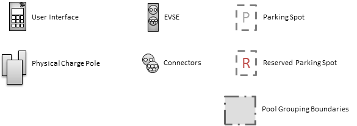

 * **User Interface** is used by the EV User to interact with the 
   charging station in terms of authorisation, authentication, payment 
   or charging process controlling purpose. Common examples for a user 
   interface is a RFID card reader and a display. Also a keypad and 
   direct payment methods are possible additions.
 * **Physical Charge Pole** is the case mounted on the location. In the 
   scope of this protocol there is no distinction between wall-mounted 
   and stand-alone charge poles. Even other concepts are possible but 
   do not interfere the data model.
 * **EVSE** is one charge point that can independently be used for EV 
   charging. It may host one or multiple connectors which can be used 
   exclusively.
 * **Connector** is the physical power outlet the electric vehicle is 
   connected to. May also be inductive.
 * **Parking Spot** offers space for exactly one car. Depending on the 
   location and physical constraints like the cable, it is possible to 
   assign one parking spot to multiple charge points.
 * **Reserved Parking Spot** is for a dedicated user group only. Common 
   examples are company fleet cars or car sharing cars.
 * **Pool Grouping Boundaries** illustrate the virtual grouping of 
   multiple EVSEs to one pool.


##### Example One
is showing one charging station (at one postal address) which itself 
consists of one physical charge pole. This pole holds two EVSEs or 
charge points for simultaneous use. Each of those EVSEs offers two 
different connectors of different type. Those can be used exclusively 
only. The two EVSEs can be accessed through a mutual user interface. 
For each EVSE one single parking spot is reserved.
This example represents the most common case for public charging 
stations. The charging station consists of one single charge pole only. 
Therefore there is a risk to confuse the terms pole and station. The 
following examples will make the difference clear.


##### Example Two
is showing two charging stations (at two different postal addresses) of 
which each consists of one physical charge pole. Each of those poles 
holds two EVSEs or charge points for simultaneous use. Each of those 
EVSEs offers two different connectors of different type. Those can be 
used exclusively only. The two EVSEs can be accessed through a mutual 
user interface. For each EVSE one single parking spot is reserved.
In fact, the two charging stations in this example are just exactly two 
times example one. Each of the stations is placed at a individual 
location not related to each other.

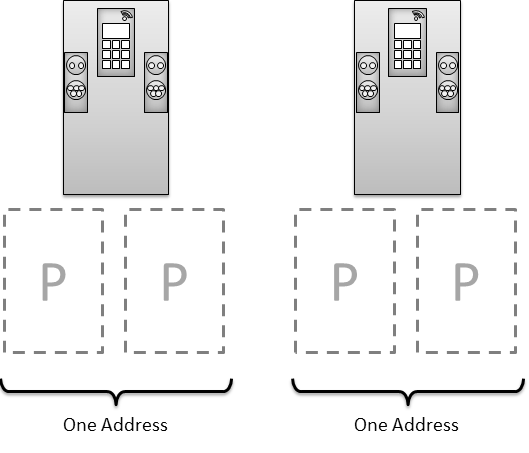


##### Example Three
is showing one charging station (at one postal address) which consists 
of two physical charge poles. Each of those poles holds two EVSEs or 
charge points for simultaneous use. Each of those EVSEs offers two 
different connectors of different type. Those can be used exclusively 
only. The two EVSEs can be accessed through a mutual user interface. 
For each EVSE one single parking spot is reserved. The charging station 
can be utilized by four cars simultaneously as it has four EVSEs and 
hence has four parking spots in total.
In contrast to example two, both charge poles are located close to each 
other at the same postal address. Therefore they are communicated as 
one single charging station to the user. Other circumstances like a 
common electrical connection or a mutual controlling and communication 
unit is not decisive for this combination.


##### Example Four
is showing one charging station (at one address) which consists of four 
physical charge poles. Each of those poles holds one EVSE or charge 
point for simultaneous use. Each of those EVSEs offers two different 
connectors of different type. Those can be used exclusively only. All 
four EVSEs of the four charge poles can be accessed through a mutual 
user interface, installed in a separate pole at the charging station. 
For each EVSE one single parking spot is reserved. The charging station 
can be utilized by four cars simultaneously as it has four EVSEs and 
hence has four parking spots in total.
This example is similar to the previous example three. This one 
charging station may be communicated to the user under one single name. 
In the attributes for the station the user will find the number of 
charge points which is the same as in example three.

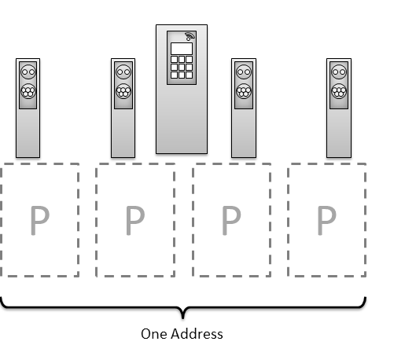


## Charge Point Information Filtering

The Navigation Service Provider displays charging point information to 
the EV User. Usually not all charge points are relevant for every user. 
The most common case is to display only compatible stations to the car 
that have at least one available charge point. To gain a mutual 
understanding of the different filtering steps between the EVSE 
Operator and the NSP, the following description is provided.
Every charge point is represented by a static data set 
(*ChargePointInfo*) and additional dynamic data (*EvseStatusType*). The 
filtering for compatible charge points close to the current location of 
the EV user is performed on the static data which may be stored locally 
on the navigation device. In a second step the result may be filtered 
for current availability.

##### Preface
Based on the characteristics of the user's car and other preferences as 
well as the current location, a set of possible charge points can be 
determined. Based on such a set the further filtering for currently 
available charge points is described in the figure below. 
The six steps are:

 * **A** All charge points that are not operative for various 
   reasons are to be removed from the set. (status not equal 
   *Operative*)
 * **B** Charge points that have no regular operating hours at the 
   current moment are to be removed from the set. (*now* not in 
   operatingTimes.regularHours)
 * **C** Charge points that have a exceptional closing at the 
   current moment are to be removed from the set. (*now* in 
   operatingTimes.exceptionalClosings)
 * **D** Those charge points from step *B* that have exceptional 
   openings have to be re-added to the set. (*now* in 
   operatingTimes.exceptionalOpenings)
 * **E** All other charge points that remain in the set and the 
   charge points from step *D* are considered operative and 
   accessible at the current moment and may be tested for 
   availability.
 * **F** Charge points with a live status value other than 
   *Available* are to be removed. (liveStatus not eqal *Available*)

The remaining charge points in the data set are operative and available 
at the current moment and can be displayed to the EV User.

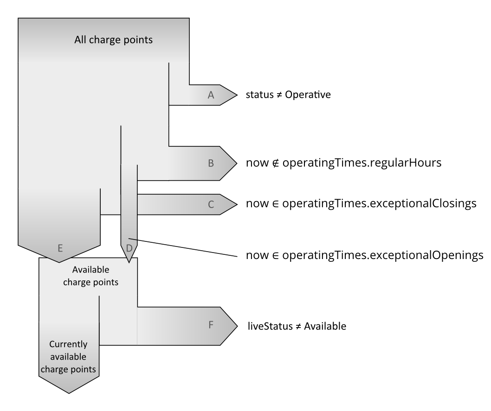
